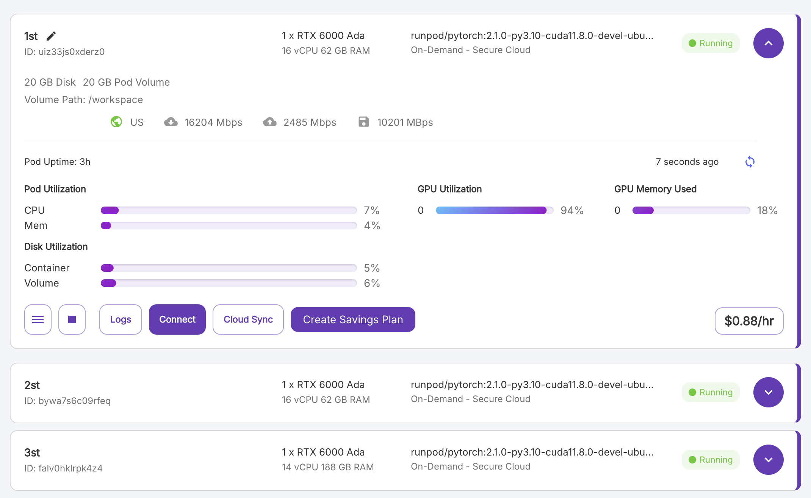
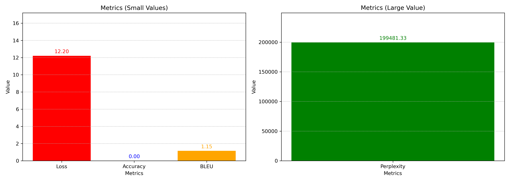
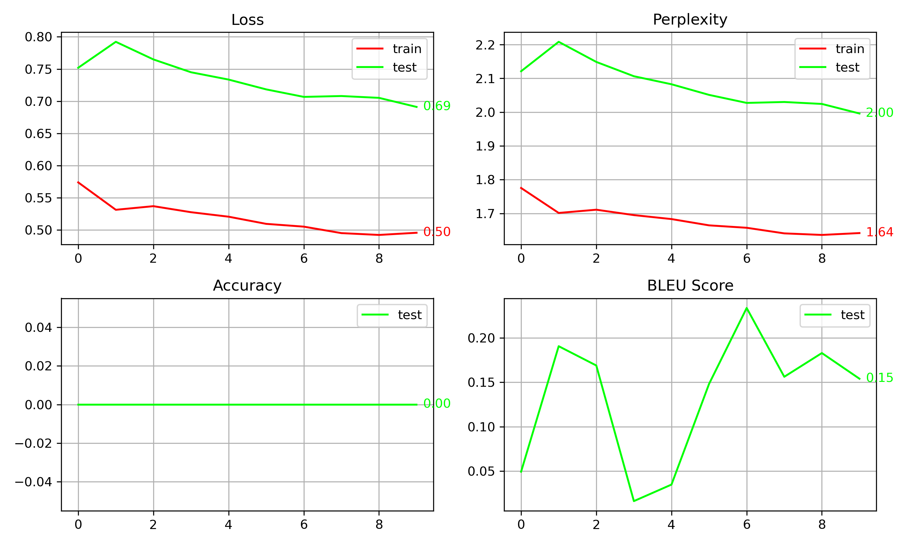
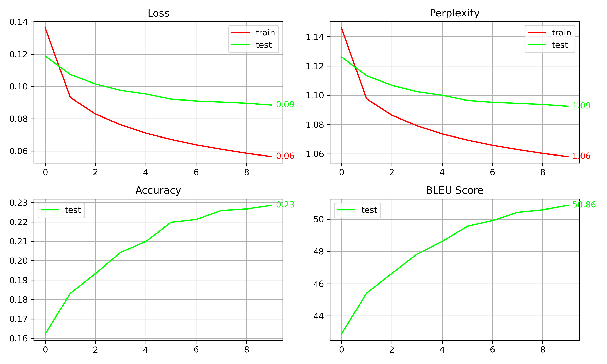
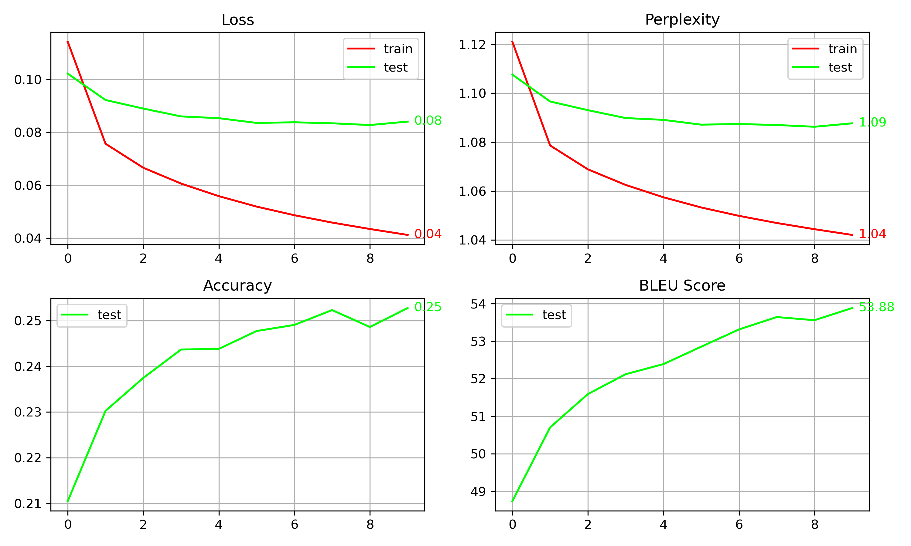
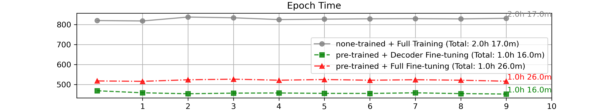
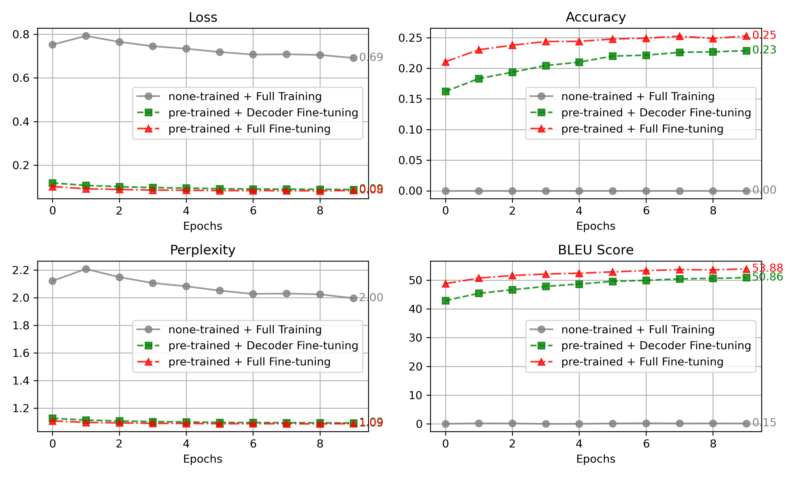

# 테스트

- 목차

# Machine Translation with T5 Models

## **Q1) 어떤 task를 선택하셨나요?**

> Machine translation(기계 번역)
> 

---

## Q2) 모델은 어떻게 설계하셨나요? 설계한 모델의 입력과 출력 형태가 어떻게 되나요?

> **모델 활용:** `T5ForConditionalGeneration` 모델은 인코더-디코더(Seq2Seq) 구조를 기반으로 설계되어 있으며, 텍스트 입력을 받아 디코더가 텍스트를 생성하는 방식으로 동작한다.
> 
> 
> ---
> 
> **입력 형태:**
> 
> - input_ids: (batch_size, ~512) (문장 길이에 따라 달라짐)
> 
> **출력 형태:**
> 
> - 학습: logits: (batch_size, sequence_length, 32128)
> - 추론: output_ids: (batch_size, target_sequence_length)
> 
> **학습(Training) 단계:**
> 
> - 인코더에 input_ids를 입력하고,
> - 디코더에 decoder_input_ids와 labels를 사용하여 정답과 비교하며 학습한다.
> 
> **추론(Inference) 단계:**
> 
> - 인코더에 input_ids를 입력하고,
> - 디코더는 하나의 토큰씩 **자동 생성(autoregressive)** 방식으로 문장을 만듭니다.
> - `generate` 함수를 사용해 반복적으로 다음 토큰을 예측하며,
>     - `max_length`, `num_beams` 등을 사용해 생성 방식을 조정할 수 있다.
> 
> **데이터 예시:**
> 
> ```python
> 영어: "Run!"  
> 프랑스어: "Cours!" 
> ```
> 
> | 구성 요소 | 입력 형태 | 출력 형태 | 설명 |
> | --- | --- | --- | --- |
> | **Shared Embedding** | (batch_size, sequence_length) | (batch_size, sequence_length, 512) | 토큰 ID를 512차원 임베딩 벡터로 변환 |
> | **Encoder** | (batch_size, sequence_length) | (batch_size, sequence_length, 512) | 입력 문장을 문맥적 벡터로 인코딩 |
> | **Decoder (Training)** | (batch_size, sequence_length) | (batch_size, sequence_length, 512) | 인코더 출력을 참고해 문장 생성 (학습 시) |
> | **Decoder (Inference)** | (batch_size, 1) | (batch_size, target_sequence_length, 512) | 토큰을 하나씩 생성 (추론 시) |
> | **lm_head** | (batch_size, sequence_length, 512) | (batch_size, target_sequence_length, 32128) | 각 타임스텝에서 어휘 분포로 변환 |
> 
> ### 1. (Shared) Embedding
> 
> **입력 텍스트는 토크나이즈(tokenize)되어 토큰 ID로 변환되고, 이는 512차원의 벡터로 임베딩된다.**
> 
> ```
> T5ForConditionalGeneration(
>   (shared): Embedding(32128, 512)
> ```
> 
> - 인코더와 디코더에서 동일한 임베딩 테이블을 공유한다.
> - 32128은 T5 토크나이저의 기본 어휘 개수(vocab size), 512는 히든 차원(d_model)을 의미
> 
> ---
> 
> ### 2. Encoder (인코더): T5Stack
> 
> **입력 시퀀스(예: 문장)를 문맥적(hidden state)으로 변환하는 역할**
> 
> ```
> (encoder): T5Stack(
>   (embed_tokens): Embedding(32128, 512)
> ```
> 
> - 인코더에서 사용하는 임베딩 레이어:  실제로는 shared 임베딩과 동일한 파라미터를 가리킨다.
> 
> ```python
> (block): ModuleList(
>   (0): T5Block(
> ```
> 
> - T5-Small은 인코더 레이어가 6개 (T5-Base는 12개, T5-Large는 24개 등)
> - 각 인코더 블록(T5Block)은 크게 두 부분으로 구성:
>     - `T5LayerSelfAttention`
>     - `T5LayerFF` (Dense -> ReLU -> Dense)
> - T5Block 내부 구조
>     
>     `T5LayerSelfAttention`
>     
>     ```python
>     (0): T5LayerSelfAttention(
>                 (SelfAttention): T5Attention(
>                   (q): Linear(in_features=512, out_features=512, bias=False)
>                   (k): Linear(in_features=512, out_features=512, bias=False)
>                   (v): Linear(in_features=512, out_features=512, bias=False)
>                   (o): Linear(in_features=512, out_features=512, bias=False)
>                   (relative_attention_bias): Embedding(32, 8)
>                 )
>                 (layer_norm): T5LayerNorm()
>                 (dropout): Dropout(p=0.1, inplace=False)
>               )
>     ```
>     
>     - (q, k, v, o): 512→512 선형 변환
>     - relative_attention_bias: T5가 사용하는 상대적 위치 정보(Embedding(32, 8))를 통해, 단순 절대 위치 대신 상대 거리에 따른 attention bias를 학습
>         - 6번 반복중 첫 번째에서만!
>     - layer_norm: 레이어 정규화
>     - dropout(p=0.1): 드롭아웃 적용
>     
>     `T5LayerFF`
>     
>     ```python
>     (1): T5LayerFF(
>       (DenseReluDense): T5DenseActDense(
>         (wi): Linear(in_features=512, out_features=2048, bias=False)
>         (wo): Linear(in_features=2048, out_features=512, bias=False)
>         (dropout): Dropout(p=0.1, inplace=False)
>         (act): ReLU()
>       )
>       (layer_norm): T5LayerNorm()
>       (dropout): Dropout(p=0.1, inplace=False)
>     )
>     ```
>     
>     - Feed-Forward 부분(`DenseReluDense`)
>         - wi: Linear(512 → 2048)
>         - wo: Linear(2048 → 512)
>         - dropout(p=0.1)
>         - act: ReLU
>     
>     인코더의 각 레이어는 (Self-Attn) → (Feed-Forward) 순서로 6번 반복해서 진행된다.
>     
>     `final_layer_norm`:
>     
>     ```python
>     (layer_norm): T5LayerNorm()
>     ```
>     
>     - T5LayerNorm(): 인코더 블록을 전부 지난 뒤, 마지막으로 출력 hidden state에 대한 레이어 정규화.###
>     
>     `dropout`
>     
>     ```python
>     (dropout): Dropout(p=0.1, inplace=False)
>     ```
>     
>     - Dropout(p=0.1)- 인코더 출력 단에 적용되는 드롭아웃(확률 0.1).
> 
> ---
> 
> ### 3. Decoder (디코더)
> 
> **디코더는 인코더 출력을 참고하면서 새로운 텍스트 시퀀스(토큰)를 생성하는 역할**
> 
> ```python
> (decoder): T5Stack(
>     (embed_tokens): Embedding(32128, 512)
> ```
> 
> - 디코더 입력을 512차원으로 매핑
> - 마찬가지로 shared 임베딩과 동일 파라미터.
> - T5-Small에서 디코더도 6개 레이어를 가진다. 디코더 블록은 인코더 블록과 달리,
>     
>     1. Self-Attention 
>     
>     2. Cross-Attention(인코더-디코더 어텐션) 
>     
>     3. Feed-Forward의 3단 구조를 가집니다
>     
> 1. `Self-Attension`
>     
>     ```python
>     (0): T5LayerSelfAttention(
>                 (SelfAttention): T5Attention(
>                   (q): Linear(in_features=512, out_features=512, bias=False)
>                   (k): Linear(in_features=512, out_features=512, bias=False)
>                   (v): Linear(in_features=512, out_features=512, bias=False)
>                   (o): Linear(in_features=512, out_features=512, bias=False)
>                   (relative_attention_bias): Embedding(32, 8)
>                 )
>                 (layer_norm): T5LayerNorm()
>                 (dropout): Dropout(p=0.1, inplace=False)
>               )
>     ```
>     
>     - 디코더에 대한 어텐션.
>     - 통상적으로 미래 토큰은 가려지는(Causal Mask) 형태로 동작(look-ahead mask).
>     - relative_attention_bias를 통해 디코더 내에서도 상대적 위치정보 사용. (0번째 레이어에서만)
> 2. `Cross-Attention(인코더-디코더 어텐션)` 
>     
>     ```python
>     (1): T5LayerCrossAttention(
>                 (EncDecAttention): T5Attention(
>                   (q): Linear(in_features=512, out_features=512, bias=False)
>                   (k): Linear(in_features=512, out_features=512, bias=False)
>                   (v): Linear(in_features=512, out_features=512, bias=False)
>                   (o): Linear(in_features=512, out_features=512, bias=False)
>                 )
>                 (layer_norm): T5LayerNorm()
>                 (dropout): Dropout(p=0.1, inplace=False)
>               )
>     ```
>     
>     - 디코더가 인코더 출력(=Key,Value)에 대하여 어텐션을 수행
>     - 디코더 hidden state가 Query가 되어, 인코더 hidden state(서로 다른 시퀀스 길이)를 K, V로 삼아 컨텍스트를 얻는다.
>     - 이를 통해 번역이나 요약 등 입력 문맥을 참고하여 적절한 단어를 생성한다.
> 3. `Feed-Forward`
>     
>     ```python
>     (2): T5LayerFF(
>                 (DenseReluDense): T5DenseActDense(
>                   (wi): Linear(in_features=512, out_features=2048, bias=False)
>                   (wo): Linear(in_features=2048, out_features=512, bias=False)
>                   (dropout): Dropout(p=0.1, inplace=False)
>                   (act): ReLU()
>                 )
>                 (layer_norm): T5LayerNorm()
>                 (dropout): Dropout(p=0.1, inplace=False)
>               )
>     ```
>     
>     - 인코더와 동일한 구조(DenseReluDense)  512→2048→512 + ReLU.
>     - 또한 각 레이어마다 layer_norm, dropout이 적용
> 
> **모든 레이어를 통과 한 후:**
> 
> ```python
> (final_layer_norm): T5LayerNorm()
> (dropout): Dropout(p=0.1, inplace=False)
> ```
> 
> - 최종적으로 레이어 정규화.
> - 드롭아웃
> 
> ### 4. **lm_head (언어 모델 헤드)**
> 
> ```python
> (lm_head): Linear(in_features=512, out_features=32128, bias=False)
> ```
> 
> - 디코더 출력(최종 hidden state 512차원)을 vocab 크기(32128)로 매핑.
> - 각 타임스텝에서 단어 분포(로짓)를 산출하여, 소프트맥스하면 다음 토큰 확률을 얻게된다.
> - `bias=False` → 모델을 간결하게 만들고, 효율적인 학습을 유도하기 위해 편향 사용 안함

---

## Q3) 어떤 pre-trained 모델을 활용하셨나요?

> **Pre-trained 모델:** `T5-small`
> 
> 
> **설명**:
> 
> T5는 방대한 양의 텍스트를 **Text-to-Text 방식**으로 사전 학습했기 때문에 문맥을 잘 파악하고, 파인튜닝시 데이터가 적더라도 번역, 문서 요약, 질의응답 등 다양한 작업에서 우수한 성능을 보여줍니다. 
> 
> 특히, **T5-small** 모델은 빠르고 가벼워서 소규모 프로젝트나 자원이 제한된 환경에서도 효율적으로 사용할 수 있으며, 상대적으로 적은 파라미터를 사용해도 괜찮은 성능을 기대할 수 있어 빠른 프로토타입 제작이나 실험에 유리합니다.
> 
> | 모델 버전 | **T5-Small** | **T5-Base** | **T5-Large** | **T5-3B** | **T5-11B** |
> | --- | --- | --- | --- | --- | --- |
> | **파라미터 수** | 약 **60M** | 약 **220M** | 약 **770M** | 약 **3B** | 약 **11B** |
> | **히든 크기** | 512 | 768 | 1024 | 1024 | 1024 |
> | **레이어 수 (layers)** | 8 | 12 | 24 | 24 | 24 |
> | **어텐션 헤드 수** | 8 | 12 | 16 | 32 | 32 |
> | **피드포워드 차원** | 2048 | 3072 | 4096 | 16384 | 65536 |
> | **성능 (BLEU)** | 보통 | 좋음 | 우수 | 매우 우수 | 최고 수준 |
> | **훈련 시간** | 짧음 | 중간 | 김 | 매우 김 | 극도로 김 |
> | **메모리 사용량** | 낮음 | 중간 | 높음 | 매우 높음 | 극도로 높음 |
> | **추론 속도** | 빠름 | 중간 | 느림 | 매우 느림 | 극도로 느림 |
> 
> ---
> 
> **다른 모델과 비교:**
> 
> | 모델 | 설명 | 장점 | 단점 | 사용 사례 |
> | --- | --- | --- | --- | --- |
> | **T5 (Text-to-Text Transfer Transformer)** | 모든 NLP 작업을 text-to-text 형식으로 처리하는 트랜스포머 기반 모델. | 통합된 프레임워크, 다양한 NLP 작업 가능 | 큰 모델 크기, 학습 비용이 높음 | 번역, 요약, QA |
> | **mBART (Multilingual BART)** | BART를 기반으로 다국어 문장 복원을 학습한 모델. | 다국어 지원, 다양한 언어 번역 가능 | 리소스 소모가 큼, 특정 언어에 최적화 필요 | 다국어 기계 번역, 문장 생성 |
> | **M2M-100 (Many-to-Many)** | 100개 이상의 언어 간 직접 번역 가능한 페이스북 AI의 모델. | 사전 학습된 다국어 모델, 언어 간 직접 번역 지원 | 모델 크기 매우 큼, 많은 데이터 필요 | 다국어 번역 |
> | **GPT (Generative Pre-trained Transformer)** | 대규모 텍스트 생성 및 언어 모델링. | 텍스트 생성 능력 탁월, 다양한 응용 가능 | 번역 품질은 BLEU 등에서 낮을 수 있음 | 텍스트 생성, 요약 |
> | **MarianMT (Marian Machine Translation)** | OpenNMT 기반으로 구축된 번역 모델로, 특정 언어 쌍에 최적화됨. | 빠른 훈련 및 번역, 다양한 언어 쌍 지원 | 언어 쌍별로 별도 모델 필요 | 특정 언어 쌍 번역 |
> 
> ---
> 
> **학습 환경:**
> 
> - Runpod 클라우드:  빠른 학습 및 평가를 위해 RTX 6000 Ada 3개 이용
> - 총 대여 비용: 8.073$
> 
> 
> 
> **로드**:
> 
> - Hugging Face Transformers 라이브러리를 사용하여 사전 학습된 T5 모델과 토크나이저를 로드
> - 버전: Hugging Face Transformers v4.x
> 
> ```python
> from transformers import T5Tokenizer, T5ForConditionalGeneration
> import torch
> 
> model_name = "t5-small"
> 
> device = torch.device("cuda" if torch.cuda.is_available() else
>                       "mps" if torch.backends.mps.is_available() else
>                       "cpu")
>                       
> tokenizer = T5Tokenizer.from_pretrained(model_name)                      
> model     = T5ForConditionalGeneration.from_pretrained(model_name)
> ```
> 

---

## 기계 번역 평가 지표 (Metrics)

| 지표 | 정의 | 좋은 값 기준 | 비고 |
| --- | --- | --- | --- |
| **Loss** | 예측과 실제 번역 간 차이 | 0.05 ~ 0.10 | 과적합 시 Loss만 낮을 수 있음 |
| **Accuracy** | 완전히 일치하는 번역 문장 비율 | 0.30 ~ 0.60 | BLEU와 병행 평가 필요 |
| **Perplexity** | 번역 예측에 대한 불확실성 | 1.0 ~ 1.2 | 1.5 이상이면 불안정 |
| **BLEU Score** | 번역 품질 평가 지표 | 40 이상 (50 이상 우수) | 실제 번역 품질 평가에 가장 중요 |

### 📌 **해석 포인트:**

- Loss와 Perplexity는 낮을수록 좋고, Accuracy와 BLEU는 높을수록 좋다.
- 특히 BLEU와 Perplexity는 번역 품질을 평가하는 데 중요한 핵심 지표
- Accuracy는 문장이 완벽하게 일치하는지 평가하지만,
- BLEU는 부분적인 일치도를 평가하므로 BLEU가 더 현실적이다.
- 지표를 단독으로 해석하지 않고, 서로 보완적으로 해석하는 것이 필요하다.

---

## Q4) 실제로 pre-trained 모델을 fine-tuning했을 때 loss curve은 어떻게 그려지나요? 그리고 pre-train 하지 않은 Transformer를 학습했을 때와 어떤 차이가 있나요?

> **비교:**
> 
> 1. Only Pre-trained Upstream
> 2. Non-trained + Full Training
> 3. Pre-trained + Decoder Fine-tuning
> 4. Pre-trained + Full Fine-tuning
> 
> (각 Training & Fine-tuning은 모두 10 Epoch 수행하였음)
> 
> ---
> 
> ### **1. Only Pre-trained Upstream**
> 
> - **설명:** 사전 학습된 t5-model 모델을 그대로 사용하여 번역을 수행. 추가적인 파인튜닝 없이 평가.
> - **코드:**
>     
>     ```python
>     model = T5ForConditionalGeneration.from_pretrained('t5-small').to(device)
>     
>     # T5 모든 파라미터 동결
>     for param in model.parameters():
>         param.requires_grad = False
>      
>     # 훈련 없이 평가만 진행   
>     with torch.no_grad():
>     		average_loss, perplexity, acc, bleu_score = evaluate_model(model, test_loader, tokenizer)
>     ```
>     
> - **성능:**
>     - Loss, Accuracy, Perplexity, BLEU Score
>     
>     
>     
> - **결과 해석:**
>     - Loss가 12.20으로 상당히 높아, 모델이 학습된 데이터와 현재 사용한 데이터 간에 차이가 크다는 것을 알 수 있다.
>     - Perplexity가 비정상적으로 높으며, 정확도는 0에 가깝다.
>     - BLEU 점수도 매우 낮아, 번역의 품질이 떨어진다.
>     - T5는 upstream 태스크는 현재 downsteram 태스크(english→french번역)에는 맞지 않다.
>     → 파인 튜닝이 필요하다.
> 
> ---
> 
> ### 2. Non-trained + Full Training
> 
> - **설명**: 사전 학습 없이 t5-model 모델을 처음부터 완전히 학습시킴.
> - **코드:**
>     
>     ```python
>     from transformers import T5Config, T5ForConditionalGeneration
>     
>     # 사전 학습된 't5-small' 모델의 구성(config)을 불러온다.
>     # 구성 정보에는 모델의 레이어 수, 히든 사이즈, vocab 크기 등 모델 구조에 대한 정보가 포함
>     config = T5Config.from_pretrained('t5-small')
>     
>     # 위에서 불러온 설정(config)을 기반으로 T5 모델 초기화
>     # 이 단계에서는 가중치가 랜덤으로 초기화됩니다
>     model = T5ForConditionalGeneration(config).to(device)
>     ```
>     
> - **성능**:
>     - Loss, Accuracy, Perplexity, BLEU Score
>     
>     
>     
> - **결과 해석**:
>     - Loss는 감소하지만, 에포크 10번 만으로는 Perplexity와 Accuracy에서 기대 이하의 성능을 보인다.
>     - 특히 Accuracy가 계속 0인 점은 모델이 학습한 내용을 실제 번역에 제대로 반영하지 못함을 보여준다.
>     - BLEU 점수도 낮고, 변동성이 크기 때문에 학습의 안정성이 부족한 상태다.
> 
> ---
> 
> ### 3. Pre-trained + Decoder Fine-tuning (+lm_head)
> 
> - **설명**: 사전 학습된  t5-model 모델의 인코더는 고정하고, 디코더만 파인튜닝
> - **코드:**
>     
>     ```python
>     model = T5ForConditionalGeneration.from_pretrained('t5-small').to(device)
>     
>     # 인코더 가중치 고정 (디코더만 학습)
>     for param in model.encoder.parameters():
>         param.requires_grad = False  # 인코더 가중치 고정
>     ```
>     
> - **성능**:
>     - Loss, Accuracy, Perplexity, BLEU Score
>     
>     
>     
> - **결과 해석**:
>     - 디코더만 파인튜닝했음에도 테스트 손실, perplexity, 정확도, BLEU 점수에서 상당한 성능 향상을 확인할 수 있다.
>     - 특히 BLEU 점수 상승이 두드러져 번역 품질이 크게 개됨
>     - 인코더를 고정했기 때문에 훈련 비용이 절감되며, 적은 자원으로도 좋은 성능을 기대할 수 있다.
> 
> ---
> 
> ### 4. Pre-trained + Full Fine-tuning
> 
> - **설명**: 사전 학습된  t5-model 모델의 모든 파라미터를 파인튜닝.
> - **코드:**
>     
>     ```python
>     model = T5ForConditionalGeneration.from_pretrained('t5-small').to(device)
>     
>     lr = 0.001
>     optimizer = AdamW(model.parameters(), lr=lr)
>     
>     n_epochs = 10
>     start_epoch = 0
>     
>     for epoch in range(start_epoch, n_epochs):
>         start_time = time.time()  # 에포크 시작 시간 기록
>     
>         total_train_loss = 0.
>         model.train()
>     
>         for batch in tqdm(train_loader):  # tqdm으로 진행 상황 시각화
>             optimizer.zero_grad()  # 기울기 초기화
>             input_ids = batch['input_ids'].to(device)
>             attention_mask = batch['attention_mask'].to(device)
>             labels = batch['labels'].to(device)
>     
>             # T5 모델에서 직접 loss 계산
>             outputs = model(input_ids=input_ids, attention_mask=attention_mask, labels=labels)
>             loss = outputs.loss  # T5는 자체적으로 loss 반환
>     
>             # 역전파 및 최적화
>             loss.backward()
>             optimizer.step()
>     
>             total_train_loss += loss.item()	
>             
>         with torch.no_grad():
>             model.eval()
>     
>             # 정확도, BLEU 계산
>             test_average_loss, test_perplexity, test_acc, test_bleu_score = evaluate_model(model, test_loader, tokenizer)
>     ```
>     
> - **성능**:
>     - Loss, Accuracy, Perplexity, BLEU Score
>     
>     
>     
> - **결과 해석**:
>     - 모든 파라미터를 파인튜닝함으로써, 가장 높은 성능을 보임.
>     - 모델이 훈련 데이터에 대해 잘 수렴하고 있으며, 테스트 데이터에서도 성능이 크게 저하되지 않음
>     - Perplexity는 여전히 조금 높게 유지 되므로 새로운 데이터에서 모델이 완벽하지는 않다는 것을 의미한다. → 그러나 이 수준의 perplexity는 허용 가능한 범위.
>     - BLEU 점수와 정확도의 꾸준한 상승은 모델이 번역 및 생성 작업에서 좋은 성능을 발휘하고 있음을 알 수 있다.
> 
> ---
> 
> ### **종합 비교**
> 
> 
> 
> 
> 
> - **Epoch Time (10회 에포크 시간):**
>     - 사전 학습 없이 처음부터 학습하는 경우 시간이 가장 오래 걸린다. (2시간 17분)
>     - 디코더만 학습하는 경우가 가장 효율적 (1시간 16분)
>     - 인코더와 디코더 모두 학습해도 상대적으로 훈련 시간이 크게 증가하지는 않음. (1시간 26분)
> - **Loss (손실):**
>     - none-trained 모델은 학습이 제대로 이루어지지 않아 손실이 거의 변화하지 않는다.
>     - 사전 학습된 모델을 활용할 경우 손실이 매우 낮다.
>     - Full Fine-tuning이 가장 좋은 성능을 보인다.
> - **Accuracy (정확도):**
>     - none-trained + Full Training: 정확도 0.00으로 학습이 거의 이루어지지 않음.
>     - Decoder Fine-tuning: 정확도가 0.23까지 상승
>     - Full Fine-tuning: 정확도가 0.25로 가장 높음.
> - **Perplexity (당혹도):**
>     - none-trained 모델은 perplexity가 높아, 모델이 예측에 대한 확신을 갖지 못하고 있음을 의미
>     - Full Fine-tuning: 초기 1.14에서 최종 1.08까지 감소.
> - **BLEU Score (번역 품질):**
>     - 사전 학습 없이 학습한 경우, 번역 품질이 극도로 낮다.
>     - Decoder Fine-tuning만으로도 BLEU 점수가 크게 상승하지만,
>     - Full Fine-tuning이 가장 좋은 번역 품질을 제공한다.

---

## 결론

이번 프로젝트에서는 T5 모델을 활용하여 영어-프랑스어 기계 번역을 수행하였습니다. 네 가지 다양한 학습 설정을 통해 사전 학습의 효과와 파인튜닝의 중요성을 비교 분석하였습니다.

1. **Only Pre-trained Upstream**: 사전 학습된 모델을 그대로 사용했을 때의 성능을 확인하였습니다.
2. **Non-trained + Full Training**: 사전 학습 없이 처음부터 모델을 학습시켰을 때의 성능을 평가하였습니다.
3. **Pre-trained + Decoder Fine-tuning**: 인코더는 고정하고 디코더만 파인튜닝하였을 때의 성능을 평가하였습니다.
4. **Pre-trained + Full Fine-tuning**: 모든 파라미터를 파인튜닝하여 최상의 성능을 도출하였습니다.

**핵심 발견**:

- 사전 학습된 모델을 파인튜닝하면, 초기 학습 속도와 최종 성능이 크게 향상됩니다.
- 사전 학습 없이 모델을 처음부터 학습시키는 경우, 많은 데이터와 시간이 필요하며 성능도 낮을 수 있습니다.
- 디코더만 파인튜닝하는 방식은 일부 성능 향상을 보이나, 전체 파인튜닝에 비해 제한적입니다.

**향후 연구 방향**:

- 더 큰 규모의 T5 모델(T5-base, T5-large)을 사용하여 성능 향상 가능성 탐색.
- 데이터 증강 기법을 도입하여 모델의 일반화 능력 강화.
- 다양한 하이퍼파라미터 튜닝을 통해 최적의 학습 설정 도출.

---

## 참고 자료

- [Hugging Face Transformers Documentation](https://huggingface.co/docs/transformers/index)
- [T5: Exploring the Limits of Transfer Learning with a Unified Text-to-Text Transformer](https://arxiv.org/abs/1910.10683)
- [BLEU Score Explanation](https://en.wikipedia.org/wiki/BLEU)

---

## GitHub Repository

[https://github.com/adunStudio/hanghae99_plusAI_2/blob/main/3주차/[3주차] 심화과제.ipynb](https://github.com/adunStudio/hanghae99_plusAI_2/blob/main/3%EC%A3%BC%EC%B0%A8/%5B3%EC%A3%BC%EC%B0%A8%5D%20%EC%8B%AC%ED%99%94%EA%B3%BC%EC%A0%9C.ipynb)

---