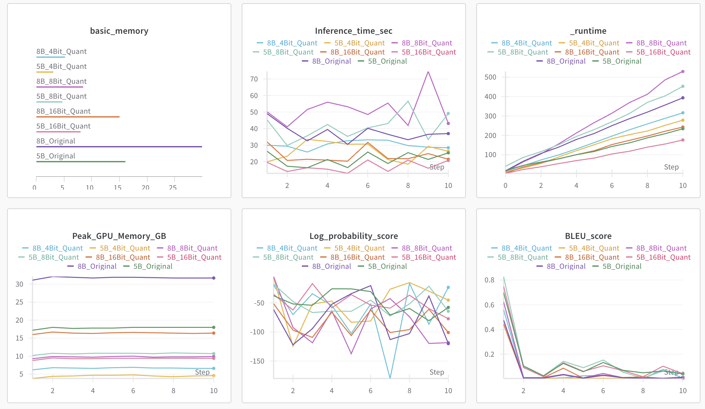

# 8주차 심화 과제

## 사용 모델
- [MLP-KTLim/llama-3-Korean-Bllossom-8B](https://huggingface.co/MLP-KTLim/llama-3-Korean-Bllossom-8B)
- [Bllossom/llama-3.2-Korean-Bllossom-AICA-5B](https://huggingface.co/Bllossom/llama-3.2-Korean-Bllossom-AICA-5B)
- 환경: L40S(48 GB VRAM)

## Metrics

## 양자화 비교

| 설정 | 메모리 사용량 | 연산 속도 | 속도 저하 가능성 |
|------|------------|----------|---------------|
| **FP32 (32비트)** | 🟥 **가장 큼** | 🟥 **가장 빠름** | ❌ 없음 |
| **FP16 (16비트)** | 🟨 **50% 절감** | 🟩 **FP32보다 빠름** | ❌ 없음 |
| **8비트 양자화 (INT8)** | 🟩 **50% 추가 절감 (FP16 대비)** | 🟨 **약간 느릴 수도 있음** | ⚠️ **경우에 따라 발생 가능** |
| **4비트 양자화 (NF4)** | 🟩 **최대 75% 절감** | 🟧 **FP16보다 느릴 가능성 높음** | ⚠️ **성능 저하 가능** |

✅ **FP32 → FP16 변환 시 연산 속도 증가**  
✅ **FP16 → 8비트(INT8) 변환 시, 경우에 따라 속도가 약간 느려질 수 있음**  
✅ **4비트 양자화(NF4)에서는 속도 저하가 더 심할 수 있음**  

이론과 실제는 같다...