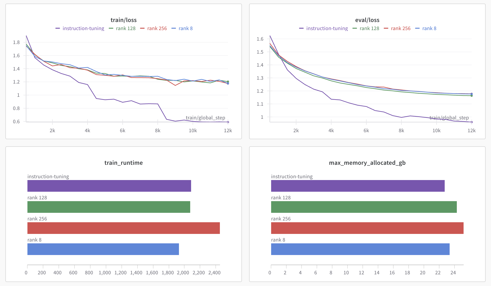

# 8주차 기본과제
Instruction-tuning vs LoRA(Rank 8) vs LoRA(Rank 128) vs LoRA(Rank 256)

- [train/loss](https://api.wandb.ai/links/iamkimhongil92-lumenasoft/qbrgvsot)
- [eval/loss](https://api.wandb.ai/links/iamkimhongil92-lumenasoft/5cy5d494)
- [train_runtime](https://api.wandb.ai/links/iamkimhongil92-lumenasoft/l5aefrku)
- [max_memory_allocated_gb](https://api.wandb.ai/links/iamkimhongil92-lumenasoft/ri9ubu2z)

Instruction-tuning이 여러 LoRA 설정에 비해 성능이 더 좋아 보입니다.

## 1. train/loss 및 eval/loss 그래프
- 모든 설정에서 훈련이 진행됨에 따라 손실 값이 꾸준히 감소하는 경향을 보입니다.
- Instruction-tuning이 학습 중 더 빠르게 손실(loss)을 감소시키며, 최종 손실 값도 LoRA Rank 설정들에 비해 낮습니다.
- Rank 8, 128, 256은 손실 감소가 다소 느리며 서로 큰 차이는 없습니다.

## 2. train_runtime 그래프
- Rank 8은 가장 짧은 훈련 시간을 소요했습니다.
- Instruction-tuning이 LoRA Rank 128 및 256보다 훈련 시간이 짧습니다.
- Rank 256은 가장 긴 훈련 시간을 소요했습니다.

## 3. max_memory_allocated_gb 그래프
- Instruction-tuning은 메모리 사용량이 LoRA Rank 256과 비슷하거나 약간 적은 수준입니다.
- Rank 8에서는 메모리 사용량이 현저히 낮습니다.

## 4. 전반적인 성능 비교
- Instruction-tuning은 빠른 손실 감소와 우수한 최종 성능을 보여주며, 훈련 시간도 비교적 짧습니다.
- LoRA Rank 256은 Instruction-tuning에 가까운 성능을 보이지만, 훈련 시간이 길고 메모리 사용량도 높습니다.
- Rank 128과 Rank 8은 성능이 떨어지며, 특히 Rank 8에서는 충분한 최적화가 이루어지지 않은 것으로 보입니다.

## 5. 종합 해석
- Instruction-tuning은 훈련 및 평가 손실 모두에서 가장 낮은 값(좋은 성능)을 기록했지만, 훈련 시간과 메모리 사용량이 높습니다.
- Rank 8은 Instruction-tuning에 비해 훈련 시간에서 효율적이지만, 손실 감소가 느리고 최종 손실 값이 높아 성능이 낮을 가능성이 있습니다.
- Rank 128, 256은 Rank 8에 비해 좋은점이 없습니다.
